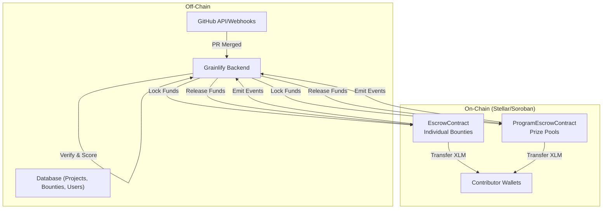

# Smart Contract Architecture for Grainlify

## Overview

Grainlify uses Soroban smart contracts on the Stellar network to implement escrow functionality for bounties and program prize pools. The contracts act as secure, non-custodial vaults with minimal on-chain logic, while verification and coordination happen off-chain through the Grainlify backend.

## Contract Types

### 1. EscrowContract

Manages escrow for individual bounties. Each bounty has its own escrow record.

### 2. ProgramEscrowContract

Manages escrow for hackathon/program prize pools. Each program has its own escrow record.

## Data Structures

### EscrowContract Data Structure

```rust
#[derive(Clone)]
pub struct EscrowData {
    pub project_id: String,
    pub bounty_id: String,
    pub contributor_address: Option<Address>,
    pub amount: i128,
    pub locked_at: u64,
    pub deadline: Option<u64>,
    pub status: EscrowStatus,
}

#[derive(Clone, Eq, PartialEq)]
pub enum EscrowStatus {
    Locked,
    Released,
    Refunded,
}
```

### ProgramEscrowContract Data Structure

```rust
#[derive(Clone)]
pub struct ProgramEscrowData {
    pub program_id: String,
    pub total_funds: i128,
    pub remaining_balance: i128,
    pub authorized_payout_key: Address,
    pub created_at: u64,
}
```

## Contract Interfaces

### EscrowContract Functions

- `lock_funds(bounty_id: String, amount: i128, contributor_address: Option<Address>, deadline: Option<u64>) -> Result<(), ContractError>`
  - Locks funds for a specific bounty
  - Stores the escrow data
  - Emits FundsLocked event

- `release_funds(bounty_id: String, recipient: Address) -> Result<(), ContractError>`
  - Releases funds to the recipient
  - Updates status to Released
  - Emits FundsReleased event
  - Only callable by authorized payout key

- `refund(bounty_id: String, initiator: Address) -> Result<(), ContractError>`
  - Refunds funds to the initiator
  - Updates status to Refunded
  - Emits FundsRefunded event
  - Only callable by authorized payout key or after deadline

- `get_balance(bounty_id: String) -> i128`
  - Returns the current balance for the bounty

### ProgramEscrowContract Functions

- `lock_funds(program_id: String, amount: i128, authorized_payout_key: Address) -> Result<(), ContractError>`
  - Locks funds for a program prize pool
  - Stores the program escrow data
  - Emits FundsLocked event

- `release_funds(program_id: String, recipient: Address, amount: i128) -> Result<(), ContractError>`
  - Releases specified amount to recipient
  - Decrements remaining_balance
  - Emits FundsReleased event
  - Only callable by authorized payout key

- `refund(program_id: String, initiator: Address) -> Result<(), ContractError>`
  - Refunds remaining funds to initiator
  - Emits FundsRefunded event
  - Only callable by authorized payout key

- `get_balance(program_id: String) -> i128`
  - Returns the remaining balance for the program

## Event Emission Structure

### EscrowContract Events

- `FundsLocked(bounty_id: String, amount: i128, locked_at: u64)`
- `FundsReleased(bounty_id: String, recipient: Address, amount: i128)`
- `FundsRefunded(bounty_id: String, initiator: Address, amount: i128)`

### ProgramEscrowContract Events

- `FundsLocked(program_id: String, amount: i128, locked_at: u64)`
- `FundsReleased(program_id: String, recipient: Address, amount: i128)`
- `FundsRefunded(program_id: String, initiator: Address, amount: i128)`

## Architecture Diagram



## Authorization Model

### EscrowContract
- **lock_funds**: Callable by anyone (typically project maintainers via backend)
- **release_funds**: Only callable by the authorized payout key (held by backend)
- **refund**: Callable by authorized payout key or after deadline by the original locker
- **get_balance**: Public read access

### ProgramEscrowContract
- **lock_funds**: Callable by anyone (typically ecosystems via backend)
- **release_funds**: Only callable by the authorized payout key (held by backend)
- **refund**: Only callable by the authorized payout key
- **get_balance**: Public read access

The backend maintains the authorized payout keys and ensures that only verified, KYC-approved contributors receive payouts. All authorization logic is enforced on-chain to prevent unauthorized fund movements.